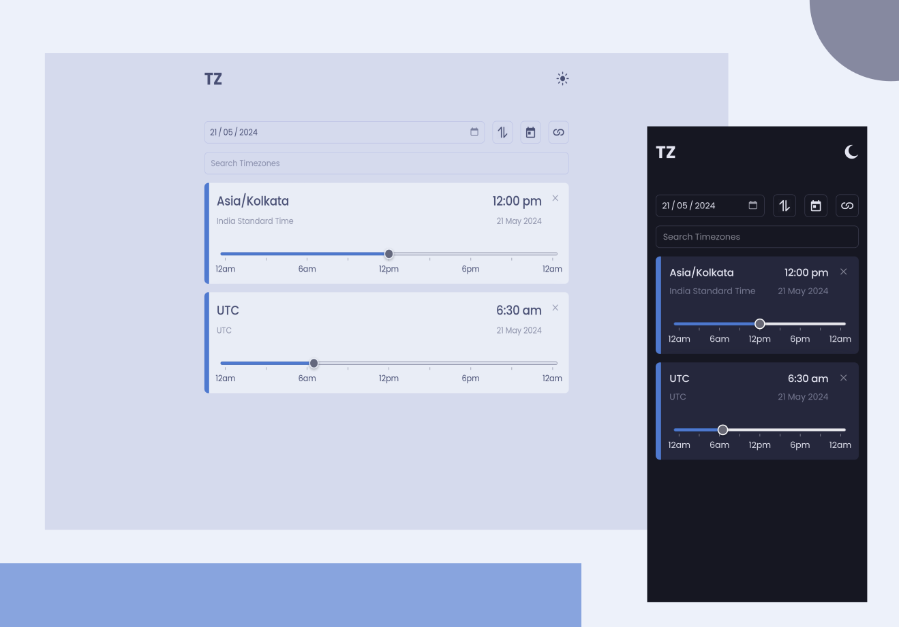
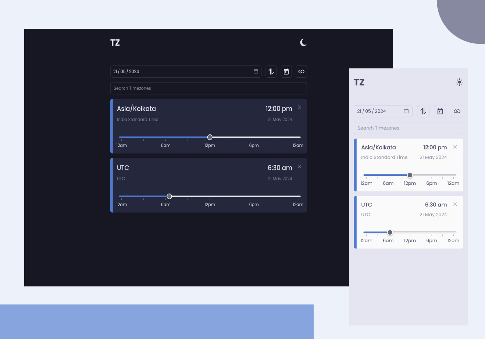

# Frontend Task - Timezone Converter

This project is a react app that converts time between a set of selected timezones. A time zone is a set of rules, associated with a geographical location, that determines the local offset from UTC at any given time. The app allows you to search and add a zone by its IANA string, such as "Asia/Kolkata".

## Table of Contents

- [Frontend Task - Timezone Converter](#frontend-task---timezone-converter)
  - [Table of Contents](#table-of-contents)
  - [Features](#features)
  - [Design](#design)
  - [Links](#links)
  - [Built with](#built-with)
  - [Running locally](#running-locally)
  - [Author](#author)


## Features

- Convert selected time between UTC and IST.
- Add new timezones
- Drag to reorder timezones
- Remove a specific timezone from the list
- Select a custom date
- Reverse the order of zones
- Toggle theme between dark and light
- Shareable public link with time and zones info
- ~~Add meet link to calendar~~

## Design






## Links

**[Live site here](https://pptzs.pages.dev/)**


## Built with

- [React](https://reactjs.org/)
- [Luxon](https://moment.github.io/luxon/#/)
- CSS Modules

## Running locally

1. **Clone the repository:**
    ```bash
    git clone https://github.com/imbekrishna/pptask.git
    cd pptask/frontend-task
    ```
2. **Install the dependencies**
    ```bash
    npm install
    ```
3. Start the dev server
   ```bash
    npm run dev
   ```
4. Visit [http://localhost:5173](http://localhost:5173/) to view in dev mode.

5. To build the app for production
   ```bash
   npm run build
   ```
6. Preview production build at [http://localhost:4173](http://localhost:4173/)
   
   ```bash
    npm run preview
   ```
7. Upload the `dist` folder to hosting provider in order to deploy it.

## Author

- Website - [Bal Krishna](https:/bkrishna.pages.dev)
